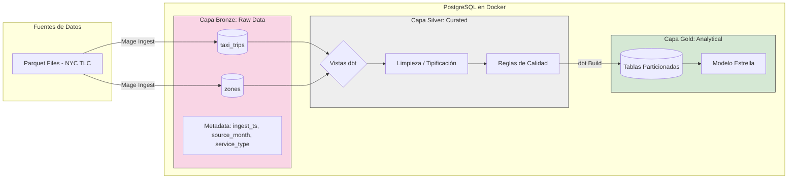
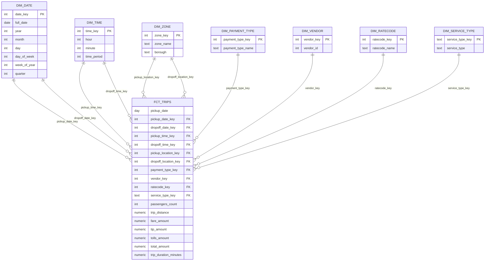
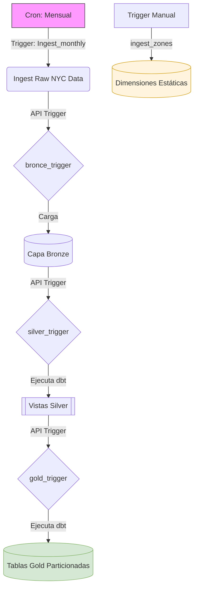

# PST#2

**Instrucciones:**

Construir un data pipeline orquestado 100% con Mage que ingeste datos del dataset NYC
TLC Trip Record Data (Yellow y Green), aterrice la capa bronze en PostgreSQL (Docker),
estandarice y depure en silver, y modele un esquema estrella en gold usando dbt ejecutado
desde Mage

---
# 1) Arquitectura 
- Raw: Datos crudos recien cargados desde los parquets proporcionados por NYC taxis

- Bronze: Datos crudos cargados desde  NYC TLC a PostgreSQL, incluyendo metadatos de ingesta (ingest_ts, source_month, service_type). Se crean dos tablas una para viajes y otra para zonas

- .Silver: Vistas de limpieza y estandarización (tipificación, reglas de calidad y enriquecimiento con zonas con dbt)

- .Gold: Modelo estrella particionado (tablas) para análisis de negocio


### Diagra Estrella



# 2) Tabla de cobertura por mes y servicio

Esta sección detalla el alcance de la ingesta y el resultado del proceso de limpieza. La diferencia entre el row_count de Bronze y Silver representa los registros filtrados por no cumplir con las reglas de calidad (ej. tiempos negativos o zonas inválidas).

Bronce (parcial)

|service_type    |source_month|count           |status|
|----------------|------------|----------------|------|
|green           |2022-01     |62495           |loaded|
|yellow          |2022-01     |2463931         |loaded|
|green           |2022-02     |69399           |loaded|
|yellow          |2022-02     |2979431         |loaded|
|green           |2022-03     |78537           |loaded|
|yellow          |2022-03     |3627882         |loaded|
|green           |2022-04     |76136           |loaded|
|yellow          |2022-04     |3599920         |loaded|
|green           |2022-05     |76891           |loaded|
|yellow          |2022-05     |3588295         |loaded|

Silver

|service_type    |source_month|count           |status|
|----------------|------------|----------------|------|
|green           |2022-01     |62280           |loaded|
|yellow          |2022-01     |2449592         |loaded|
|green           |2022-02     |69176           |loaded|
|yellow          |2022-02     |2962189         |loaded|
|green           |2022-03     |78303           |loaded|
|yellow          |2022-03     |3605986         |loaded|
|green           |2022-04     |75921           |loaded|
|yellow          |2022-04     |3578638         |loaded|
|green           |2022-05     |76704           |loaded|
|yellow          |2022-05     |3566175         |loaded|


# 3) Levantar el proyecto

## 1. Clonar el repositorio

```bash
git clone https://github.com/Lhao13/Pset-2
cd <repo>
```

## 2. Levantar contenedores

```bash
docker compose up -d
```

Verificar:

```bash
docker ps
```

Deberías ver contenedores similares a:

- Mage: Corre el pipeline y hace toda la gestion en dbt
- pgadmin:  Es el visor del la base de datos
- postgres:  La base de datos (no se cargan todos lo archivos de la base porque es muy pesada)

## 3.Acceder a Mage

```bash
http://localhost:6789
```
Los triggers se pueden encontra al lado izquierdo de la pantalla para corre los pipelines


---

# 4) Nombres de Mage pipelines y qué hace cada uno

## taxi_extract_load

Incercion de la data inicial cargada desde la pagina de NYC taxi se usa un link para esta carga y se va variando los datos de fechas y el tipo de taxi (yellow, green)

```bash
https://d37ci6vzurychx.cloudfront.net/trip-data/{color}_tripdata_{year}-{month}.parquet
```
Todo el modelo se carga a el schema de raw con las siguientes columnas

|Columna              |Tipo de Dato    |Descripción / Nota                   |
|---------------------|----------------|-------------------------------------|
|vendorid             |smallint        |ID del proveedor                     |
|tpep_pickup_datetime |timestamp       |Fecha/hora de inicio del viaje       |
|tpep_dropoff_datetime|timestamp       |Fecha/hora de fin del viaje          |
|store_and_fwd_flag   |text            |Flag de almacenamiento y reenvío     |
|ratecodeid           |double precision|ID de la tarifa aplicada             |
|pulocationid         |smallint        |ID de zona de recogida (PULocationID)|
|dolocationid         |smallint        |ID de zona de destino (DOLocationID) |
|passenger_count      |double precision|Número de pasajeros                  |
|trip_distance        |double precision|Distancia del viaje                  |
|fare_amount          |double precision|Importe de la tarifa                 |
|extra                |double precision|Cargos extras                        |
|mta_tax              |double precision|Impuesto MTA                         |
|tip_amount           |double precision|Monto de la propina                  |
|tolls_amount         |double precision|Monto de peajes                      |
|ehail_fee            |text            |Cuota de granizo (Green taxi)        |
|improvement_surcharge|double precision|Recargo de mejora                    |
|total_amount         |double precision|Importe total pagado                 |
|payment_type         |double precision|Tipo de pago                         |
|trip_type            |double precision|Tipo de viaje                        |
|congestion_surcharge |double precision|Recargo por congestión               |
|service_type*        |text            |Metadato: 'yellow' o 'green'         |
|source_month*        |text            |Metadato: Mes de origen (YYYY-MM)    |
|ingest_ts*           |timestamp       |Metadato: Fecha/hora de ejecución    |
|airport_fee          |double precision|Tarifa de aeropuerto                 |
|cbd_congestion_fee   |double precision|Tarifa de congestión CBD             |


## zones_extract_load

Incersion de la data de zonas desde un CSV, con el proposito de unirla mas adelante

```bash
https://d37ci6vzurychx.cloudfront.net/misc/taxi_zone_lookup.csv
```
|Columna              |Tipo de Dato    |Descripción / Nota                   |
|---------------------|----------------|-------------------------------------|
|locationid          |smallint        |ID único de la zona                  |
|borough |text      |Distrito (Manhattan, Brooklyn, etc.)       |
|_zone|text      |Nombre de la zona específica          |
|service_zone   |text            |Zona de servicio designada     |

## Bronce

Para bronce creamos primero la tabla stg_taxi_trips con los siguiente valores. Donde se agregan tres valores para trazabilida. Reduccion de numero de columnas a unicamente las que no  interezan en base al modelo oro que vamos a relizar (menor consumo de espacio, en total hay 167 millones de datos)

- service_type: tipo de servicio si es verde o amarillo
- source_month:  el mes y año desde el que se extra
- ingest_ts: el momento en la que la data se ingesto en el modelo
- trip_duration_minutes: duracion del viaje calculado

|Columna              |Tipo de Dato    |Origen / Descripción                |
|---------------------|----------------|------------------------------------|
|vendorid             |smallint        |ID del proveedor                    |
|pickup_ts |timestamp       |Fecha y hora de recogida            |
|dropff_ts|timestamp       |Fecha y hora de llegada             |
|passenger_count      |double precision|Número de pasajeros                 |
|trip_distance        |double precision|Distancia del viaje                 |
|pickup_location         |int       |ID de zona de recogida (PULocationID)|
|dropff_location         |int        |ID de zona de destino (DOLocationID) |
|ratecodeid           |double precision|Código de tarifa aplicada           |
|payment_type         |double precision|Tipo de pago                        |
|fare_amount          |double precision|Importe de la tarifa                |
|tip_amount           |double precision|Monto de propina                    |
|tolls_amount         |double precision|Monto de peajes                     |
|total_amount         |double precision|Importe total                       |
|service_type         |text            |Metadato: 'yellow' o 'green'        |
|source_month         |text            |Metadato: Mes del archivo (YYYY-MM) |
|ingest_ts            |timestamp       |Metadato: Fecha/hora de carga       |
|trip_duration_minutes          |numerioc       |Metadato: duracion del viaje      |


Despues creamos la tabla stg_zone con los mismo datos que obtuvimos de raw:

|Columna              |Tipo de Dato    |Descripción                         |
|---------------------|----------------|------------------------------------|
|locationid           |smallint        |ID único de la zona (Taxi Zone ID)  |
|borough              |text            |Distrito (Borough)                  |
|_zone                |text            |Nombre de la zona                   |
|service_zone         |text            |Zona de servicio (e.g., Yellow Zone)|


## Silver

En silver se realizan las validaciones correspodientes para crear una nueva vista unificada entre stg_zone y stg_taxi_trips

|Columna              |Tipo / Origen   |Descripción                                  |
|---------------------|----------------|---------------------------------------------|
|vendor_id            |integer         |ID del proveedor (coalesce a 0 si es nulo).  |
|pickup_ts            |timestamp       |Fecha/hora de inicio del viaje (No nulo).    |
|dropff_ts            |timestamp       |Fecha/hora de fin del viaje (No nulo).       |
|passengers_count     |integer         |Cantidad de pasajeros (clamped entre 0 y 10).|
|trip_distance        |numeric         |Distancia recorrida (Debe ser ≥0).           |
|pickup_location      |integer         |ID de zona de origen.                        |
|dropff_location      |integer         |ID de zona de destino.                       |
|ratecode_id          |integer         |Código de tarifa aplicada.                   |
|payment_type         |integer         |Tipo de pago (coalesce a 0 si es nulo).      |
|fare_amount          |numeric         |Importe base de la tarifa.                   |
|tip_amount           |numeric         |Importe base de la tip.                      |
|tolls_amount         |numeric         |Importe base de la peaje                     |
|total_amount         |numeric         |Importe total pagado (Debe ser ≥0).          |
|service_type         |text            |Tipo de servicio: 'yellow' o 'green'.        |
|ingest_ts            |timestamp       |Metadato: Fecha/hora de carga       |
|trip_duration_minutes          |numerioc       |Metadato: duracion del viaje      |
|trip_duration_minutes|numeric         |Duración calculada del viaje en minutos.     |
|pickup_location_name |text            |Enriquecido: Nombre de la zona de origen.    |
|dropoff_location_name|text            |Enriquecido: Nombre de la zona de destino.   |

- Integridad de Timestamps (not_null, expression_is_true): Garantiza que no existan viajes sin tiempo registrado y que la fecha de recogida sea siempre igual o anterior a la de llegada (pickup_ts <= dropff_ts).

- Consistencia de Zonas (relationships): Valida que cada location_id en los viajes exista realmente en la tabla maestra de zonas (stg_zones).

- Dominios de Datos (accepted_values):

  - Pasajeros: Solo se permiten valores del 0 al 10 para evitar datos atípicos o erróneos.


  - Tipo de Servicio: Asegura que solo existan categorías 'yellow' o 'green'.

- Validaciones Físicas (expression_is_true):


 - Distancia: La distancia del viaje no puede ser negativa (trip_distance >= 0).


 - Monto Total: El pago total no puede ser negativo (total_amount >= 0).

- Consistencia Temporal (SQL Filter): El código filtra viajes que no pertenezcan al mes de ingesta (source_month) para evitar el arrastre de datos de años anteriores o registros mal procesados en el origen. Esta logica solo se aplica al campo pickup_ts ya que un viaje puede empezar en un mes y terminar en otro. Ningun dato de pickup_ts o dropff_ts puede ser una fecha menos al 2022-01-01

Apartir de todo esto se limpiar un aproximado de 3 millones de datos sucios

## Gold

La capa Gold materializa los datos en tablas finales, permitiendo responder a las 20 preguntas de negocio con alta eficiencia.

Se crean 7 dimensiones para nuestro modelo oro:
- dim_date
- dim_time
- dim_zone
- dim_payment_type
- dim_vendor
- dim_ratecode
- dim_service_type

|Tabla                |Tipo de Partición|Propósito                                    |
|---------------------|-----------------|---------------------------------------------|
|dim_date             |Estándar         |Atributos temporales (Año, Mes, Día, Quarter).|
|dim_zone             |HASH             |Información geográfica (Borough, Zone Name). |
|dim_service_type     |LIST             |Diferencia entre 'yellow' y 'green'.         |
|dim_payment_type     |LIST             |Categorización del método de pago.           |
|dim_time             |Estándar         |Granularidad horaria y periodos del día.     |
|dim_vendor           |Estándar         |Identificación del proveedor del servicio..  |
|dim_ratecode         |Estándar         |Identificación del codigo de calificacion    |

Un documento de los taxis de NYC redacta el significado de algunos de los campos utilizados para las dimensiones de la tabla

```bash
/data_dictionary_trip_records_yellow.pdf
```
### VendorId
(A code indicating the TPEP provider that provided the record. )
- 1= Creative Mobile Technologies, LLC; 
- 2= VeriFone Inc.

### RateCodeID
(The final rate code in effect at the end of the trip.)
- 1= Standard rate
- 2=JFK
- 3=Newark
- 4=Nassau or Westchester
- 5=Negotiated fare
- 6=Group ride

### Payment_type
(A numeric code signifying how the passenger paid for the trip. )
- 1= Credit card
- 2= Cash
- 3= No charge
- 4= Dispute
- 5= Unknown
- 6= Voided trip

Creacion de la tabla Fct_trips:

|Columna              |Tipo            |Descripción                                  |
|---------------------|----------------|---------------------------------------------|
|pickup_date          |date            |Columna de Partición (RANGE): Truncado por día.|
|pickup_date_key      |int (FK)        |Referencia a dim_date para el inicio del viaje.|
|dropoff_date_key     |int (FK)        |Referencia a dim_date para el fin del viaje. |
|pickup_time_key      |int (FK)        |Referencia a dim_time (Hora/Minuto).         |
|dropoff_time_key      |int (FK)        |Referencia a dim_time (Hora/Minuto).         |
|pickup_location_key  |int (FK)        |Referencia a dim_zone.                       |
|dropoff_location_key  |int (FK)        |Referencia a dim_zone.                       |
|payment_type_key     |int (FK)       |Referencia dim_payment_type (1-6).|
|vendor_key     |int (FK)       |Referencia dim_vendor (1-2).|
|ratecode_key     |int (FK)       |Referencia dim_ratecode (1-6).|
|service_type_key     |text (FK)       |Referencia a dim_service_type ('yellow'/'green').|
|passengers_count     |int             |Medida: Cantidad de pasajeros.               |
|trip_distance        |numeric         |Medida: Distancia total del viaje.           |
|fare_amount        |numeric         |Medida: tarifa        |
|tip_amount        |numeric         |Medida: tip dado al taxi|
|tolls_amount        |numeric         |Medida: pasaje pagado|
|total_amount         |numeric         |Medida: Ingreso total (incluyendo propinas y peajes).|
|trip_duration_minutes|numeric         |Medida: Duración calculada en minutos.       |


#  5) Nombres de triggers y qué disparan

Como funciona el digrama de trigger y un funcion de como se disparan


|Nombre del Trigger|Tipo       |Descripción                                                                                                                                       |
|------------------|-----------|--------------------------------------------------------------------------------------------------------------------------------------------------|
|Ingest_monthly    |Schedule   |Se activa el primer día de cada mes para descargar los archivos Parquet más recientes de la NYC TLC API.                                          |
|ingest_zones      |Manual/Once|Carga inicial del dataset maestro de zonas de taxis. Solo se requiere ejecutar una vez debido a la baja volatilidad de estos datos.               |
|bronce_trigger    |API Event  |Se dispara automáticamente al finalizar con éxito Ingest_monthly. Inserta los datos en PostgreSQL añadiendo los metadatos de auditoría.           |
|silver_trigger    |API Event  |Orquesta la ejecución de los modelos dbt de limpieza. Transforma los tipos de datos y aplica filtros de calidad sobre la capa Bronze.             |
|gold_trigger      |API Event  |El paso final del flujo. Materializa el modelo estrella, refresca las dimensiones y asegura que el particionamiento de fct_trips esté actualizado.|

Cada trigger está configurado para ser idempotente. Si un trigger falla (por ejemplo, gold_trigger), puede ser re-ejecutado manualmente sin duplicar datos, gracias a la lógica de source_month y las condiciones de limpieza previa en los bloques de Mage. El bloque del trigger "ingest_monthly" no para si un bloque tiene error (Esta parte se ejecuta como bloque dinamico)

#  6) Gestión de secretos

Se configuran unicamente 5 secretos que son los necesarios para conectarse a la base de datos

| Secret Name | Propósito | Rotación | Responsable |
|------------|-------------|------------|-------------|
| `postgres_host` | Host de PostgreSQL | Baja | Infra |
| `postgres_port` | Puerto DB | Baja | Infra |
| `postgres_db` | Nombre DB | Baja | Infra |
| `postgres_user` | Usuario DB | Media | Infra |
| `postgres_password` | Password DB | Alta | Infra/Security |


#  7) Particionamiento

Tablas con particionamiento en el modelo Gold

|Tabla           |Tipo de Partición|Columna Clave   |Justificación                                                                                 |
|----------------|-----------------|----------------|----------------------------------------------------------------------------------------------|
|fct_trips       |RANGE            |pickup_date     |Permite el "Partition Pruning" al filtrar por fechas, evitando leer años o meses irrelevantes.|
|dim_zone        |HASH             |zone_key        |Distribuye uniformemente las zonas en 4 particiones para balancear la carga de lectura.       |
|dim_service_type|LIST             |service_type_key|Ideal para categorías discretas y fijas ('yellow', 'green').                                  |
|dim_payment_type|LIST             |payment_type_key|Organiza los datos según el método de pago (Card, Cash, etc.).                                |


Comprobacion basica para ver que el particionamiento mejora el rendimiento. Insertamos este codigo en postgres

```bash
EXPLAIN (ANALYZE, BUFFERS)
SELECT count(*) 
FROM analytics_gold.fct_trips 
WHERE pickup_date >= '2024-01-01' AND pickup_date <= '2024-01-31';
```
Resultados:

```bash
"Finalize Aggregate  (cost=65426.86..65426.87 rows=1 width=8) (actual time=4250.235..4252.344 rows=1 loops=1)"
"  Buffers: shared read=42658"
"  ->  Gather  (cost=65426.64..65426.85 rows=2 width=8) (actual time=4250.142..4252.338 rows=3 loops=1)"
"        Workers Planned: 2"
"        Workers Launched: 2"
"        Buffers: shared read=42658"
"        ->  Partial Aggregate  (cost=64426.64..64426.65 rows=1 width=8) (actual time=4226.381..4226.382 rows=1 loops=3)"
"              Buffers: shared read=42658"
"              ->  Parallel Seq Scan on fct_trips_2024_01 fct_trips  (cost=0.00..61316.84 rows=1243922 width=0) (actual time=0.515..4174.118 rows=995137 loops=3)"
"                    Filter: ((pickup_date >= '2024-01-01'::date) AND (pickup_date <= '2024-01-31'::date))"
"                    Buffers: shared read=42658"
"Planning:"
"  Buffers: shared hit=217"
"Planning Time: 1.616 ms"
"Execution Time: 4252.389 ms"
```
El tiempo de ejecucion es muy pequeño de solo 4 segundos. Para una tabla con 160 millones de registros evidencia que el tiempo es corto(Esto se evidencia en los test de llamadas donde las llamadas que incluyen una particion no toman menos de 3 minutos)

#  8) DBT

El procesamiento y modelado de datos se realiza íntegramente con dbt, ejecutado desde Mage. Aunque la arquitectura estándar comienza en Bronze, se ha incluido una capa inicial de dbt para procesar los datos aterrizados en Raw, garantizando un flujo más limpio y trazable.

|Capa            |Configuración|Propósito       |Materialización                                                                               |
|----------------|-------------|----------------|----------------------------------------------------------------------------------------------|
|Bronze          |sources.yml  |Abstrae las tablas de la base de datos Raw cargadas por Mage.|Table                                                                                         |
|Silver          |schema.yml   |Aplica limpieza, tipificación y reglas de calidad.|View                                                                                          |
|Gold            |schema.yml   |Modela el esquema estrella final para analítica.|Table                                                                                         |

### Implementación de Pruebas de Calidad (Silver)
La capa Silver es el corazón de la validación. Según los requisitos del PSet, se han implementado tests para asegurar la integridad referencial y lógica de los viajes.

Reglas de validación aplicadas:

- No Nulidad: Campos críticos como pickup_ts, dropff_ts, vendor_id y payment_type no admiten nulos.

- Integridad Referencial: Las zonas de recogida y destino deben existir en la dimensión de zonas (stg_zones).

- Valores Aceptados: El número de pasajeros debe estar en el rango [0-10] y el tipo de servicio debe ser únicamente 'yellow' o 'green'.

- Consistencia Lógica (dbt_utils): * La fecha de recogida debe ser menor o igual a la de llegada (pickup_ts <= dropff_ts).

   - La distancia y el monto total deben ser mayores o iguales a cero.

#### Resultado de `dbt test`:


### Resumen de validaciones en fct_trips (Gold):
- Integridad Referencial (Relationships): Se verifica que cada registro de viaje esté correctamente vinculado a sus dimensiones conformadas:
    - Fechas y Horas: pickup_date_key, dropoff_date_key, pickup_time_key y dropoff_time_key.
    - Geografía: pickup_location_key y dropoff_location_key vinculados a dim_zone.
    - Atributos del Negocio: Vínculos con dim_payment_type, dim_vendor, dim_ratecode y dim_service_type.

- Campos Obligatorios (Not Null): Se garantiza que las métricas esenciales (trip_distance, total_amount, passengers_count) y las llaves temporales no contengan valores nulos.

- Consistencia de Métricas (dbt_utils): Se aplican restricciones lógicas finales para asegurar datos coherentes en el notebook de análisis:
    - trip_distance >= 0
    - total_amount >= 0
    - passengers_count >= 0

Estas pruebas se ejecutan automáticamente mediante el trigger gold_trigger. El cumplimiento de estos tests es un requisito indispensable para la fase de análisis de negocio.

#  9) Troubleshooting

En el desarrollo del pipeline se presentaron diversos retos técnicos. A continuación, se detallan los tres problemas más significativos y sus respectivas soluciones:

1. Gestión de Memoria en Bloques Dinámicos (Ingesta)

    Problema: Al intentar procesar múltiples meses simultáneamente mediante bloques dinámicos en Mage, el uso de la memoria RAM se disparaba, provocando que el contenedor de Docker se detuviera o saturara el sistema de base de datos con demasiadas conexiones abiertas.

    Solución: Se optimizó la orquestación para que la ejecución de los bloques dinámicos se realice de manera secuencial y controlada. Se implementó una lógica de cierre explícito de sesiones de base de datos tras procesar cada mes, evitando la saturación de conexiones. Además, se añadió un control de errores que detiene el pipeline si la carga de un mes específico falla, garantizando la integridad de la cobertura de datos.

2. Errores en Tests de Calidad (Capa Silver)

    Problema: Los primeros intentos de ejecución de dbt test en la capa Silver resultaron en múltiples fallos debido a inconsistencias en los datos y discrepancias en el nombramiento de columnas tras la unificación de los datasets Yellow y Green.

    Solución: Se realizó una auditoría exhaustiva de los esquemas de origen y se ajustaron los modelos dbt para estandarizar los nombres de las columnas. Se implementaron filtros de limpieza estrictos para eliminar registros incoherentes, tales como viajes con duraciones negativas, montos totales menores a cero o fechas de recogida fuera del rango solicitado (ej. años fuera de 2022-2025).

3. Orquestación de Particionamiento Declarativo

    Problema: dbt no soporta de forma nativa la creación dinámica de particiones de PostgreSQL antes de la inserción de datos (dbt run). Esto causaba errores si la tabla madre intentaba recibir datos de un mes para el cual no existía aún una partición física.

    Solución: Se integró un bloque de código SQL directo en el pipeline de Mage (dbt_build_gold) que se ejecuta antes que el modelo de dbt. Este bloque asegura la creación de la estructura de particiones necesaria y garantiza la idempotencia: si la partición ya existe, el script continúa sin errores. Esto permite que dbt pueda materializar la tabla fct_trips directamente sobre las particiones correctas.

# CHECKLIST

- ✅Docker Compose levanta Postgres + Mage
- ✅Credenciales en Mage Secrets y .env (solo .env.example en repo)
- ✅Pipeline ingest_bronze mensual e idempotente + tabla de cobertura
- ✅dbt corre dentro de Mage: dbt_build_silver, dbt_build_gold, quality_checks
- ✅Silver materialized = views; Gold materialized = tables
- ✅Gold tiene esquema estrella completo
- ✅Particionamiento: RANGE en fct_trips, HASH en dim_zone, LIST en
- ✅dim_service_type y dim_payment_type
- ✅README incluye \d+ y EXPLAIN (ANALYZE, BUFFERS) con pruning
- ✅dbt test pasa desde Mage
- ✅Notebook responde 20 preguntas usando solo gold.*
- ✅Triggers configurados y evidenciados
